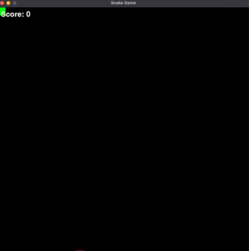

# Snake Game

This is a simple Snake Game implemented using Pygame.

<div align="center">
  
</div>

## Instructions

- Use the arrow keys to control the snake.
- The snake will move continuously in the direction of the last arrow key pressed.
- The goal of the game is to eat the food that appears on the screen and grow the snake's length.
- Be careful not to collide with the walls or the snake's own body, as it will result in game over.
- Press the **R** key to restart the game after game over.

## Dependencies

The game requires the following dependencies to be installed:

- Python 3
- Pygame

## Running the Game

To run the game, execute the following command:

```python
python main.py
```


## Gameplay

- The snake starts at the top-left corner of the window.
- The food will appear at random positions on the screen.
- The snake's length will increase each time it eats the food.
- The game will end if the snake collides with the walls or its own body.
- The score will be displayed on the screen, showing the number of food items eaten.

## Customization

You can customize certain aspects of the game by modifying the code:

- Adjust the game window size by changing the `window_width` and `window_height` variables in `main.py`.
- Change the size of each tile in pixels by modifying the `tile_size` variable in `main.py`.
- Modify the colors of the snake, food, and other elements by updating the corresponding color values in the code.
- Customize the fonts and text displayed on the screen by modifying the font settings in `main.py`.

## License

This project is licensed under the [MIT License](LICENSE).

